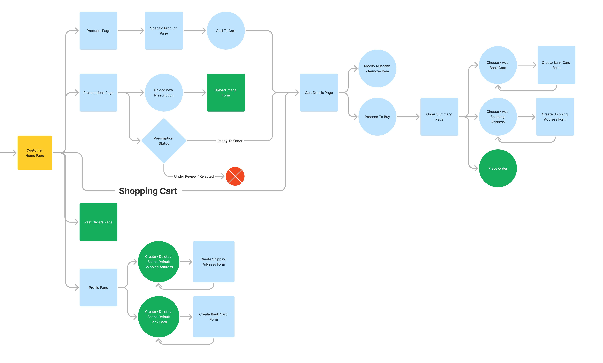

# PharmaZee
**A web-based solution for managing pharmacy activities, such as online shopping, inventory management, and human resources management.**

## Users & General Features:
- **Anonymous User:**
  - Browse products [[Demo]()]
  - Signup [[Demo]()]
  - Login [[Demo]()]
- **Customer:**
  - Add items to the shopping cart & place an order [[Demo]()]
  - Upload prescription & place an order [[Demo]()]
  - Browse past orders [[Demo]()]
  - Manage Profile [[Demo]()]
- **Admin:**
  - Register new employee [[Demo]()]
  - Confirm employee [[Demo]()]
  - Create a new branch [[Demo]()]
  - Create a new product [[Demo]()]
- **Pending Employee:**
  - Just empty home page (Can’t do any administrative actions) [[Demo]()]
- **Employee:**
  - Review prescription [[Demo]()]
## Detailed User Flow Diagram:
- Check the whole diagram [here](https://www.figma.com/board/gCmXiCSFfppBjQrXCiRa1L/PharmaZeeUserFlow?node-id=0-1&t=cXcemz27GHI2Uqpc-1)
- A glance of it
  
  
## Technologies Used:
- `C#`, `HTML`, `CSS`, `Bootstrap`, `JavaScript` and `T-SQL`
-	`.NET Core` (MVC), `.NET Identity Core` (Auth) and `Entity Framework Core` (ORM)
-	`SQL Server` and `SQL Agent` (Database)
## Future Improvements:
- Understand .NET Identity more to enhance security.
- Go deeper in EF Core for better performance and concurrency handling.
- Know how to model complex relations to add more business use cases like returns, and discounts.
- Learn about semantic search in SQL Server.
- Study more about design patterns and how to refactor messy code.
## Thank You!
**Thanks for your effort reaching here.**   
If you have any questions, modifications or recommendations, don't hesitate to contact me:
- LinkedIn: [Moamen Abdelrahman](https://www.linkedin.com/in/moamen-abdelrahman05/)
- Gmail: moamenabdelrahman05@gmail.com
